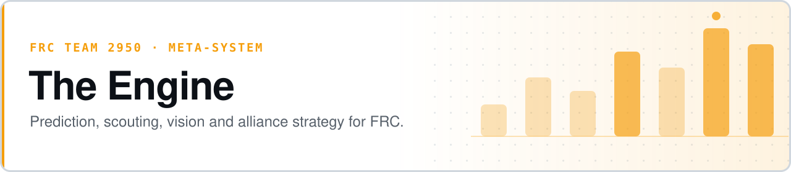

<p align="center">
  <picture>
    <source media="(prefers-color-scheme: dark)" srcset="assets/banner-dark.svg">
    
  </picture>
</p>

# The Engine

**An FRC meta-system for Team 2950: predict the game, scout the event, watch the video, pick the alliance.**

The Engine is a set of tightly-coupled Python subsystems covering the full competition lifecycle — predicting robot architecture at kickoff, scouting events, analyzing match video, running alliance selection, and generating per-match game plans. Maintained by Safiq Sindha, mentor for FRC Team 2950 (The Devastators).

- **Kickoff-day predictions that hold up** — an 18-rule game-to-architecture engine, 98% accurate against historical games 2016–2025
- **Alliance selection that models coupling** — per-season power-curve attribution, so specialist pairings are credited correctly instead of ranked by raw EPA sum
- **Match video into scouting data** — OCR match-boundary detection plus tiered model analysis, at roughly $10.50 for a 1,200-match season
- **Built for a volunteer team** — Discord-native commands, 24/7 scans, and a six-module student onboarding curriculum


**[Cross-season patterns](design-intelligence/CROSS_SEASON_PATTERNS.md)** · **[Architecture](ARCHITECTURE.md)** · **[Roadmap](design-intelligence/ENGINE_MASTER_ROADMAP.md)** · **[Mentor briefing](MENTOR_BRIEFING.md)** · **[What we built](WHAT_WE_BUILT.md)** · **[Playground](PLAYGROUND.md)**

```bash
pip install -r antenna/requirements.txt
python3 scout/the_scout.py report 2026txbel --team 2950     # pre-event scouting report
python3 engine_advisor.py "Who should 2950 pick at 2026txbel?"
```

Robot code lives at **[safiqsindha/2950-robot](https://github.com/safiqsindha/2950-robot)**. This repository persists across seasons; that one resets each year.

> **Status (2026-04-14):** the 2026 competition season is over for 2950. The system is in off-season maintenance and research mode until the 2027 kickoff.

---

## What's Inside

| Subsystem | Role | Entry points |
|---|---|---|
| **Oracle** | 18-rule game-to-architecture prediction engine. 98% accuracy against historical games 2016–2025. Lives in `blueprint/oracle.py`; rule logic derives from `design-intelligence/CROSS_SEASON_PATTERNS.md`. | `blueprint/oracle.py` |
| **Scout** | Live scouting, pre-event reports, alliance pick board, EPA trajectories, district-point Monte Carlo, historical backtester. 2026 FIT backtest: 54% exact / 81% top-3 / 91% top-5. | `scout/the_scout.py`, `scout/pick_board.py`, `scout/match_strategy.py`, `scout/backtester.py` |
| **Eye** | Vision scouting from match video. EasyOCR for match-boundary detection, Claude Haiku/Sonnet/Opus for key-frame qualitative analysis. ~$10.50 / 1,200-match FIT season on the Haiku key-frame tier. | `eye/the_eye.py`, `eye/stream_recorder.py`, `eye/eye_bridge.py` |
| **Antenna** | Chief Delphi scraper + Discord command layer. 12 live-scout Discord commands wired through `antenna/live_scout_commands.py`. 24/7 daily scans, weekly digests, alert DMs. | `antenna/bot.py`, `antenna/scraper.py`, `antenna/live_scout_commands.py` |
| **Blueprint** | Post-2026-04-13 postmortem: CAD generators cut. Remaining scope is design analysis + BOM estimation on top of Oracle output (physics/bom/oracle modules retained; generators and the OnShape MCP were deleted). | `blueprint/oracle.py`, `blueprint/attribution_betas.py`, `blueprint/rulebook_beta_prior.py` |

The subsystems talk to each other through JSON artifacts on disk and through `engine_advisor.py`, a Haiku-executor / Opus-advisor orchestrator.

---

## Power Curve Attribution (Oracle Rule #18)

Alliance credit is not linear. When robots are tightly coupled (a passer-and-shooter pair in Aerial Assist), a single robot's marginal contribution compresses; when robots act independently (Charged Up grid slots), contribution is close to proportional. The Engine models this with a per-season exponent β applied in `scout/alliance_decomposition.power_normalize()` before credit is split. β=1.0 is linear; β<1 compresses the distribution and rewards specialist pairings.

β is tuned empirically per season via grid search over match data (Statbotics + TBA), with a rulebook-derived regression providing a usable prior 48 hours after kickoff before match data exists. See `design-intelligence/ATTRIBUTION_BETA_TUNING.md` (Item 1 methodology and results) and `design-intelligence/RULEBOOK_BETA_METHODOLOGY.md` (Item 4 feature regression, fit 2026-04-14). Oracle Rule #18 reads the current season's β and shifts alliance-selection weight between raw-EPA sum (high β) and role complementarity (low β).

### β regime table

| Regime | β range | Coupling | Oracle Rule #18 behavior | Example seasons |
|---|---|---|---|---|
| Strong coupling | β < 0.70 | High — specialists required | Weight role complementarity heavily; penalize duplicate archetypes | 2014 Aerial Assist, 2016 Stronghold |
| Moderate coupling | 0.70 ≤ β < 0.85 | Mixed cycles + independent actions | Balance complementarity and raw EPA sum | 2013, 2017, 2018, 2022, 2024, 2025 |
| Near-linear | β ≥ 0.85 | Low — generalists viable | Rank alliances primarily by raw EPA sum | 2015 Recycle Rush, 2023 Charged Up |

Empirical β* values, 90% bootstrap CIs, and per-season `status` live in the results table at `design-intelligence/ATTRIBUTION_BETA_TUNING.md`.

---

## Quickstart

Requires Python 3.11+, Java 17 (robot code only), and a few API keys.

```bash
# Clone
git clone https://github.com/safiqsindha/TheEngine.git
cd TheEngine

# Python deps (per subsystem)
pip install -r antenna/requirements.txt
pip install -r requirements-test.txt

# API keys
echo "<anthropic-key>" > .anthropic_key            # Eye + Advisor
echo "<tba-key>"       > scout/.tba_key            # Scout
export ANTENNA_BOT_TOKEN=<discord-bot-token>        # Antenna
export ANTENNA_CHANNEL_ID=<channel-id>

# Tests (1,500+ test functions across 57 files)
pytest

# Common commands
python3 scout/the_scout.py report 2026txbel --team 2950
python3 scout/pick_board.py setup 2026txbel --team 2950 --seed 3
python3 scout/pick_board.py rec
python3 scout/match_strategy.py next 2026txbel --team 2950
python3 scout/backtester.py 2026fit
python3 eye/the_eye.py analyze <youtube_url> --focus 2950 --tier key --backend haiku
python3 eye/eye_bridge.py load
python3 antenna/bot.py                              # starts Discord bot
python3 engine_advisor.py "Who should 2950 pick at 2026txbel?"
```

There is no single top-level `engine` binary today — each subsystem has its own script, and `engine_advisor.py` is the closest thing to a unified entry point. Consolidating into one CLI is on the off-season roadmap.

---

## Project Layout

```
TheEngine/
  engine_advisor.py          Haiku-executor / Opus-advisor orchestrator
  engine_budget.py           Per-subsystem cost tracking
  antenna/                   Chief Delphi scraper + Discord bot + live-scout commands
  scout/                     EPA, draft board, strategy, backtester, trajectories
  eye/                       Vision pipeline, stream recorder, eye_bridge
  blueprint/                 Oracle rules, attribution β, rulebook β prior, physics, BOM
  engine/                    Shared logging / runtime helpers
  design-intelligence/       Cross-season patterns, β methodology, architecture specs, landscape scans
  src/ build.gradle          Java robot code (AdvantageKit, maple-sim, A* pathfinding)
  vendordeps/ swervelib/     Robot-code vendor deps
  tools/                     Match analysis, configs, pre-match checks
  scripts/                   Wiki updater and one-off tooling
  training/                  Six student onboarding modules
  tests/                     Python test suite (pytest)
  infra/ workers/            Deployment and background workers
  docs/                      Long-form design docs and postmortems
```

---

## Key Design Docs

All under `design-intelligence/`.

- **CROSS_SEASON_PATTERNS.md** — the core 18-rule brain. Fed into Claude at kickoff alongside `KICKOFF_TEMPLATE.md` and `TEAM_DATABASE.md`.
- **ATTRIBUTION_BETA_TUNING.md** — empirical β tuning methodology, results table, bootstrap CI method.
- **RULEBOOK_BETA_METHODOLOGY.md** — regression of β against manual-derived signals (handoff verb density, alliance-scope ratio, possession limits, co-op RP, H-rule count).
- **ORACLE_RULE_AUDIT.md** — which of the 18+ documented rules are actually wired into `blueprint/oracle.apply_rules()`.
- **ENGINE_MASTER_ROADMAP.md** — off-season roadmap (Rev-4: 471h → 310h after landscape scan).
- **LANDSCAPE_SCAN_254_BINNER_2026-04-12.md**, **LANDSCAPE_SCAN_ROBOFLOW_2026-04-12.md**, **SESSION_2026-04-12_LANDSCAPE_SCAN_FINAL_REPORT.md** — 150+ repos / 500+ org repos surveyed; adopt-vs-study triage.
- **BLUEPRINT_REV2_POSTMORTEM.md** — why the CAD generators and OnShape MCP were cut 2026-04-13.
- **PREDICTION_ENGINE_2026_SEASON_VALIDATION.md**, **PREDICTION_ENGINE_VALIDATION_14GAME.md** — accuracy validation of the 18-rule engine.
- **EYE_RUNBOOK_FIT_DCMP_2026-04-15.md**, **EYE_DRY_RUN_RESULTS_2026-04-14.md** — Eye operational runbook and dry-run results.
- **LIVE_SCOUT_ARCHITECTURE.md** — Antenna ↔ Scout ↔ Discord wiring.
- **TRAINING_MODULE_1…6** — student onboarding curriculum covering pattern rules, prediction engine, design intelligence, pathfinding, vision/YOLO, and simulation.

---

## Testing

```bash
pytest                    # 1,500+ test functions across 57 files
```

`pytest` is the source of truth — **no public CI is wired yet.** Adding it is on the off-season roadmap, alongside consolidating the per-subsystem scripts into a single `engine` CLI.

---

## Scope

The Engine is a team-specific meta-system, not a general-purpose FRC library. It assumes Team 2950's workflow, Discord server, and data sources. CAD generation was deliberately cut in the 2026-04-13 Blueprint postmortem — see [`design-intelligence/BLUEPRINT_REV2_POSTMORTEM.md`](design-intelligence/BLUEPRINT_REV2_POSTMORTEM.md) for why.

---

## License

No license file is present in this repository. Contact the maintainer before reuse.

---

*Team 2950 The Devastators · Off-season 2026–2027 · Maintained by Safiq Sindha*
